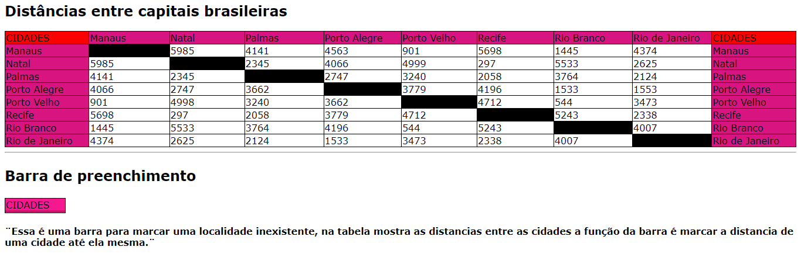

# Projeto- Tabela de distâncias entre capitais brasileiras
Projeto criado como parte avaliativa da disciplina de Fundamentos de Desenvolvimento ministrda pelo professor Leonardo Rocha.
## Índice
* [Descriçaõ](#Descrição)
* [Tecnologias](#tecnologias)
* [Referências](#referências)
* [Autor(a)](#autora)
 
### Descrição
o projeto consiste na composoição de uma tabela que conta com capitais brasileiras e a distancia entre essas capitais. As capitais constantes nesse projeto são:
 
* Campo Grande
* Cuiabá
* Curitiba
* Florianopolis
* Fortaleza
* Goiania
* Joao Pessoa
* Macapá
### Resultado do projeto 
#### Tabela
*table- O elemento <table> HTML representa dados tabulares — isto é, informações apresentadas em uma tabela bidimensional composta por linhas e colunas de células contendo dados 
* td-A tag &lt;td&lt; cria uma coluna para inserção de conteúdos, junto a diversas outras colunas em uma mesma linha
*tr-A etiqueta &lt;td&lt; que significa table data é usada para definir uma célula. As tabelas podem ter cabeçalhos.

Veja uma imagem de parte do codigo, onde é possivel indentificar o uso dos elementos mencionados a cima:

* h2-As tags H2 representam os subtítulos. Elas dividem o assunto em tópicos relevantes, suportando o H1.
Veja uma imagem de parte do codigo, onde é possivel indentificar o uso dos elementos mencionado a cima:

 
## Tecnologias
* HTML5
* CSS3
* Git
* Github
 
## Referências
 
[Alura](https://www.alura.com.br/artigos/escrever-bom-readme) - Como escrever um README incrivel no seu gitHub
 
## Autor(a)
Projeto desenvolvido pelo grupo:
* Yasmin Faria
* Geovanna Toledo